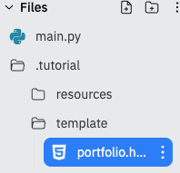

# Too. Much. Code.

As you've probably figured out by now, your flask files get pretty big pretty quickly.

No one wants all of that code in one page. It's too much.

Today we will learn how to use **templating** and **redirecting** to slim things down a bit.

##
👉 Here's some simple Flask code to start us off:

```python
from flask import Flask

app = Flask(__name__)


@app.route('/')
def index():
  myName = "David"
  page = f"""Hi {myName}"""
  return page

app.run(host='0.0.0.0', port=81)

```

👉 This is fine for small code, but for much larger projects we can create **templates** to store our HTML elsewhere.  Let's do that now:
1. Create a folder called **template**.
2. Create an HTML file called **portfolio** inside the template folder.



3. Now I'm going to paste my portfolio code from before into the portfolio page.

4. Next, I create a **CSS** folder and a file called **style.css**. I paste my CSS for the portfolio page into that file.
5. Edit my HTML in the portfolio page to fully reference the style.css file in the static folder.
```html
<link href="/static/css/portfolio.css" rel="stylesheet" type="text/css" />
```
6. Make sure all of my images, etc. are in suitable subfolders in static. Edit all the references in portfolio.html to ensure that they have the proper file paths.

## Now, back in main.py...
1. Set our fString to blank
2. Revist an old friend `f= open()`
3. Open the `portfolio.html` file
4. Read the contents into the 'page' variable
```python
@app.route('/')
def index():
  myName = "David"
  page = ""
  f = open("template/portfolio.html", "r")
  page = f.read()
  f.close()
  return page
```

## More Pages

👉 Next, I'm going to add a 'home' page to the Flask code.

```python
from flask import Flask

app = Flask(__name__)


@app.route('/')
def index():
    return 'Hello from Flask!'

@app.route('/home') # Creates the path to the home page
def home(): # Subroutine to create the home page
  # Three quotes followed by the html for the baldies site. Three more quotes to close. All the HTML is assigned to the 'page' variable
  page = """html
  
  <html>
    
  <head>
    <title>David's World Of Baldies</title>
  </head>


  <body>
  <h1>Dave's World of Baldies</h1> 
  <h2>Welcome to our website!</h2>

  <p>We all know that throughout history some of the greatest have been Baldies, let's see the epicness of their heads bereft of hair.</p>

  <h2>Gallery of Baldies</h2>
  <p>Here are some of the legends of the bald world.</p>

   
  <p><a href = "https://memory-alpha.fandom.com/wiki/Star_Trek:_Picard">Captain Jean Luc Picard: Baldest Star Trek captain, and legend.</a></p>

  <ul>
    <li>Beautiful bald man</li>
    <li>Calm and cool under pressure</li>
    <li>All the Picard memes</li>
  </ul>

  <p><a href = "page2.html">Go to page 2</a></p>
  
</body>
  
</html>
  
  """
  
  return page # returns the contents of the page variable


app.run(host='0.0.0.0', port=81)

```

Now if we visit the page *URL/home* in our browser, we will be whisked to the home page to view the design masterpiece that we've created.


### Try it out!